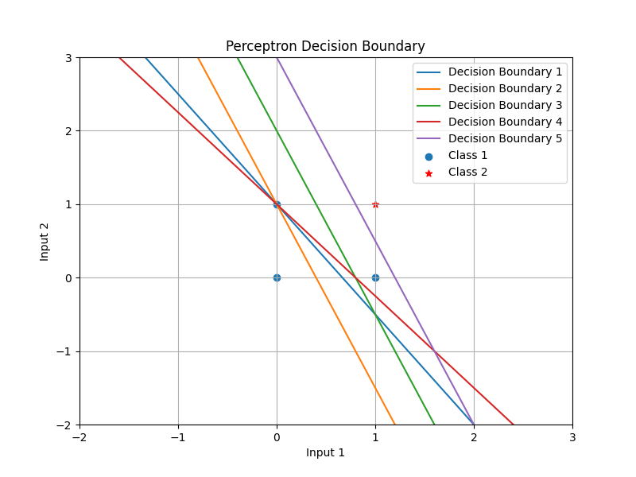

# 🧠 Perceptron Learning Rule for Two-Input AND Gate

## 📌 Project Overview
This project demonstrates the **Perceptron Learning Rule** by training a **single-layer perceptron** to learn the **two-input AND gate** function. The model updates its **weights and bias** over multiple epochs, adjusting the decision boundary dynamically. 

By the **fifth epoch**, the perceptron successfully classifies all inputs correctly, achieving convergence. The **decision boundary evolution** is visualized to illustrate the learning process.

---

## 🚀 Features
✅ **Implements Perceptron Learning Rule**  
✅ **Trains a perceptron on AND-gate logic**  
✅ **Visualizes decision boundary for each epoch**  
✅ **Demonstrates convergence in training**  
✅ **Uses NumPy and Matplotlib for computation & visualization**  

---

##  📊 Results & Visualization
1️⃣ Convergence of the Model
The perceptron converges in 5 epochs, meaning the weights stabilize, and all classifications become correct.

2️⃣ Decision Boundary Evolution
The decision boundary changes dynamically as weights are updated.
The final boundary correctly classifies all points.

  

---

##  📝 How It Works
1️⃣ Perceptron Model
Takes two binary inputs and a bias term.
Uses step activation function to classify inputs.
Adjusts weights and bias based on the perceptron learning rule.

2️⃣ Training Process
Inputs: (0,0), (0,1), (1,0), (1,1)
Target Outputs: [0, 0, 0, 1] (AND gate behavior)
Updates weights using:

$$ w_{\text{new}} = w_{\text{old}} + e \cdot x $$
$$ b_{\text{new}} = b_{\text{old}} + e $$

Stops training when all outputs match target values.

---

## 💻 Usage
Run the Python script to train the perceptron and visualize results:

python Project1_Perceptron_Learning_Rule.py

---

## 📂 Project Structure
📦 Perceptron_Learning_Rule
│-- 📄 README.md                # Project documentation
│-- 📄 Project1_Perceptron_Learning_Rule.py  # Main Python script
│-- 📄 Perceptron_Learning_Rule_Analytics.pdf # Report with detailed explanation
│-- 🖼 Input1.png    # Visualization of decision boundaries

---

##  🛠 Technologies Used
Python 🐍

NumPy 🧮 - Efficient numerical computations

Matplotlib 📊 - Visualization of decision boundaries

---

## 📖 References
Rosenblatt, F. (1958). The Perceptron: A probabilistic model for information storage and organization in the brain.

McCulloch, W. S., & Pitts, W. (1943). A logical calculus of the ideas immanent in nervous activity.

---

## 📬 Contact
👤 Hasti Zanganeh

📧 Email: zanganeh@email.sc.edu

🔗 LinkedIn: Profile

📂 GitHub: Hasti-Zanganeh

⭐ If you found this project useful, give it a star! ⭐
